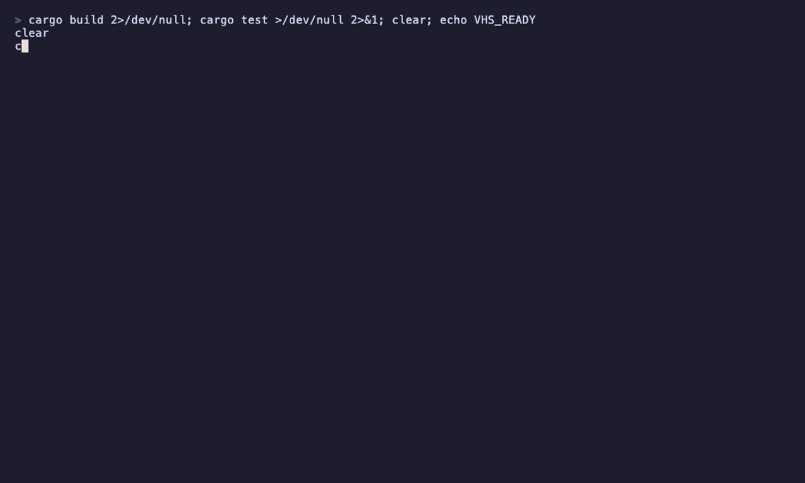

# claus

[](https://github.com/FabiMur/claus/actions/workflows/ci.yml)

Terminal coding agent built from scratch in Rust. A ratatui chat TUI drives a
multi-agent loop with tool calling implemented directly against the Anthropic
Messages REST API. Codebase context is retrieved via RAG (tree-sitter semantic
chunking, Voyage AI embeddings, Qdrant vector search), code navigation goes
through the Language Server Protocol, and external tool servers plug in via MCP.

## Demo

The agent loop: a question, hybrid retrieval over the indexed codebase, and a
streamed answer. Tool activity and the running token/cost tally render as they
happen.


Shell commands are classified before they run. `cargo test` is allowlisted and
executes straight away; `cargo clean` is not, so it stops at a y/n gate — denied
here, and the agent reports back without it.



The index keeps itself current. Editing a file outside the TUI triggers a
debounced, content-hashed re-index of just that file.


## Requirements

- Rust (stable, via rustup)
- Docker (for Qdrant)
- An Anthropic API key, and a Voyage AI API key for RAG
- Optional: `rust-analyzer` / `pyright-langserver` on `PATH` for the LSP tools

## Setup

```bash
cp .env.template .env        # fill in ANTHROPIC_API_KEY and VOYAGE_API_KEY
docker compose up -d         # start Qdrant (gRPC on :6334)
cargo run -- index           # embed the codebase into Qdrant
cargo run                    # open the TUI
```

One-shot mode without the TUI:

```bash
cargo run -- ask "where is retry logic implemented?"
```

## How it works

- `src/api` — Messages API client: typed content blocks (text, thinking,
  tool_use, tool_result), hand-written SSE streaming (responses render token
  by token), retries with backoff, and prompt caching (a `cache_control`
  breakpoint on the system prompt covers the tools + system prefix on every
  loop iteration; cache reads/writes are tracked and priced in the status bar).
  No SDK, plain REST.
- `src/agent` — the agent loop: send → execute requested tools → feed results
  back, until the model ends its turn. `dispatch_agent` spawns sub-agents with
  their own context (multi-agent, depth 1). Turns can be interrupted with Esc
  (dangling tool calls are repaired so the history stays API-valid), and old
  tool results are cleared automatically when the context grows past budget.
- `src/tools` — tool trait + registry: file read/write/edit, shell, literal
  search, RAG search, LSP navigation, MCP bridge. The shell tool sits behind a
  permission gate: read-only commands (conservative allowlist, no shell
  metacharacters) run directly; anything state-changing must be approved by the
  user — a y/n modal in the TUI, a stdin prompt in `ask` mode.
- `src/rag` — hybrid search: semantic chunking with tree-sitter (Rust/Python;
  line windows as fallback), `voyage-code-3` embeddings in one Qdrant
  collection per project, plus a hand-written BM25 index over the same chunks;
  results are combined with reciprocal rank fusion. Re-indexing is incremental
  by blake3 content hash and runs automatically via a file watcher.
- `src/lsp` — minimal LSP client (JSON-RPC over stdio, Content-Length framing):
  definition, references, hover and diagnostics. Requests wait for the server
  to finish indexing (`$/progress` tracking) instead of returning empty
  results while it warms up.
- `src/mcp` — MCP stdio client: declare servers in `.claus/mcp.json`
  (`{"servers": {"name": {"command": "npx", "args": ["-y", "..."]}}}`); their
  tools appear to the agent as `mcp__<server>__<tool>`.
- `src/tui` — ratatui chat interface: scrollback, tool activity, token usage.

## Configuration

Environment variables (see `.env.template`): `ANTHROPIC_API_KEY`,
`VOYAGE_API_KEY`, `CLAUS_MODEL` (default `claude-opus-5`), `CLAUS_MAX_TOKENS`
(default 16000), `QDRANT_URL` (default `http://localhost:6334`).

## Development

Pre-commit hooks (rustfmt, clippy `-D warnings`, cargo test, taplo, committed
for conventional commits) run on every commit:

```bash
pre-commit install --hook-type pre-commit --hook-type commit-msg
```
